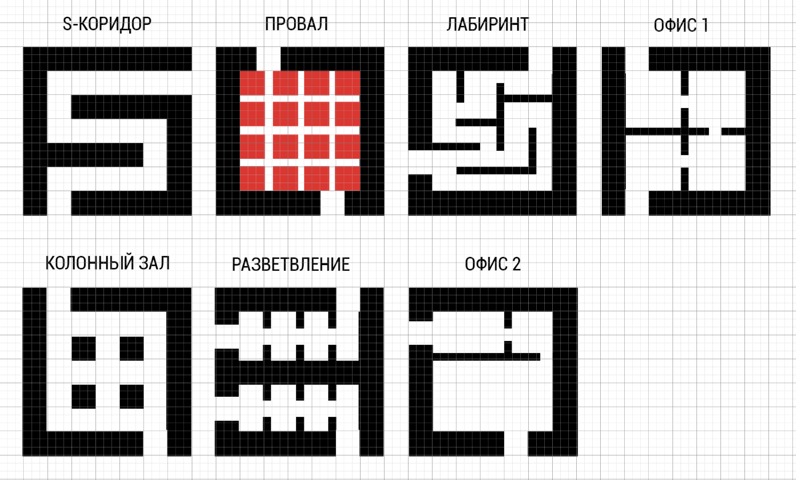

# Areas

`areas.png` is the current editable plan for area modules.

## Status

The scheme can be used as the current working source of truth for area
planning, with one condition: it is still editable and may be corrected as
generation rules evolve.

It matches the prototype direction already tested in `level_blueprint.gd`:

- area modules are based on a 15x15 panel grid;
- walls, columns, partitions, passages, and ceiling lights are placed on the
  same panel grid;
- neighboring areas should be connected through shared/merged wall geometry,
  not duplicated walls;
- passages are cut only where another connected area exists;
- lights are placed after obstacle occupancy is known.

## Units

- 1 panel = 1.25 m.
- One area = a 15x15 panel module.
- Area ceiling height follows the project standard: 4 m.
- Outer wall thickness for the current base area family: 3 panels.
- Test passage width between areas: 3 panels.
- Test inter-area passages go to the ceiling.

## Area Definition

An area is not a whole level and not a prefab room in the old sense.

An area is a 15x15 module inside which different architectural solutions can
be formed:

- empty room;
- column hall;
- S-corridor;
- pit room;
- maze-like partition layout;
- office-like partitions;
- branch/junction module;
- other future variants.

Areas may be rotated when placed.

## Connection Rules

- Inter-area passages are 3 panels wide for now.
- Passage size may be changed later, but that is a separate design topic.
- Passages are cut only in walls that touch a connected neighboring area.
- External walls and non-touching walls must not receive passages.
- Adjacent areas should be resolved into shared logical wall geometry by the
  builder.
- The final builder should generate one clean wall with one passage where
  possible, not two duplicated walls with duplicated holes.

## Passage Placement

Passages between areas should be placed to maximize the route through the
inside of an area.

Priority:

1. Choose the entrance and exit positions that produce the longest meaningful
   internal trajectory through the area.
2. Then choose the needed side for connection to the neighboring area.
3. Rotate the area if that gives a better fit while preserving the intended
   route.

The passage does not have to be geometrically centered. Route quality has
priority over symmetry.

## Internal Layouts

The internal maze shown in `areas.png` is approximate.

Internal partitions may be generated later in different ways, as long as they
respect the connection rule above: the player should be forced to travel
through the area instead of crossing it through the shortest line.

## Light Placement

Ceiling lights are placed after wall/column/partition occupancy is known.

Rules:

- do not place a light under columns, walls, or partitions;
- do not place a light in cells directly adjacent to columns, walls, or
  partitions;
- lights should follow the local area's grid rule, but obstacle clearance has
  priority over perfect repetition.

## Builder Direction

Generation should use a common logical occupancy map first:

- floor;
- ceiling;
- walls;
- passages;
- columns;
- partitions;
- pit cells;
- light cells;
- visibility/light zones.

After that, the builder should merge compatible neighboring cells into larger
rectangular blocks/meshes/collisions.

This keeps the generator from patching holes after the fact and makes runtime
visibility and light management easier.

## Current Known Area Types From `areas.png`

- `s_corridor`
- `pit`
- `maze`
- `office_1`
- `column_hall`
- `branch`
- `office_2`

Names and exact layouts are working labels and may be edited later.
