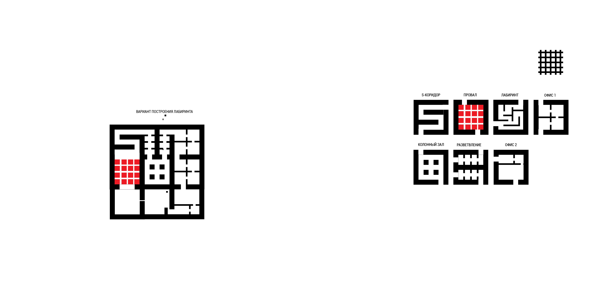

# Areas

`areas.png` is the current editable plan for area modules.

## Status

The scheme can be used as the current working source of truth for area
planning, with one condition: it is still editable and may be corrected as
generation rules evolve.

It matches the prototype direction already tested in `level_blueprint.gd`:

- area modules are based on a 15x15 panel grid;
- walls, columns, partitions, passages, and ceiling lights are placed on the
  same panel grid;
- neighboring areas should be connected through shared/merged wall geometry,
  not duplicated walls;
- passages are cut only where another connected area exists;
- lights are placed after obstacle occupancy is known.

## Units

- 1 panel = 1.25 m.
- One area = a 15x15 panel module.
- Area ceiling height follows the project standard: 4 m.
- Outer wall thickness for the current base area family: 3 panels.
- Test passage width between areas: 3 panels.
- Test inter-area passages go to the ceiling.

## Area Definition

An area is not a whole level and not a prefab room in the old sense.

An area is a 15x15 module inside which different architectural solutions can
be formed:

- empty room;
- column hall;
- S-corridor;
- pit room;
- maze-like partition layout;
- office-like partitions;
- branch/junction module;
- other future variants.

Areas may be rotated when placed.

## Connection Rules

- Passage size is a spectrum: from a 1x1 crawl-hole (crouch) through door-sized
  and wide openings up to the FULL shared wall. At full width the two areas
  merge into one space (as the 4 hub halls). Default is a wide passage (~3
  panels).
- Passages are cut only in walls that touch a connected neighboring area.
- External walls and non-touching walls must not receive passages.
- Adjacent areas should be resolved into shared logical wall geometry by the
  builder.
- The final builder should generate one clean wall with one passage where
  possible, not two duplicated walls with duplicated holes.

## Passage Placement

Passages between areas should be placed to maximize the route through the
inside of an area.

Priority:

1. Choose the entrance and exit positions that produce the longest meaningful
   internal trajectory through the area.
2. Then choose the needed side for connection to the neighboring area.
3. Rotate the area if that gives a better fit while preserving the intended
   route.

The passage does not have to be geometrically centered. Route quality has
priority over symmetry.

## Internal Layouts

The internal maze shown in `areas.png` is approximate.

Internal partitions may be generated later in different ways, as long as they
respect the connection rule above: the player should be forced to travel
through the area instead of crossing it through the shortest line.

Internal partitions may use 0.5-panel thickness when a lighter office-like
divider is needed. In that case, place the divider on the same centerline that
a full 1-panel partition would use, unless the specific area layout says
otherwise.

Office-like internal openings use the white door module as their reference
size. Door openings keep the same width as the scaled `3d/wite_door.glb`
door plus 0.18 m side clearance on each side, and the lintel starts at the
scaled door height plus 0.97 m. Empty office openings receive only the door
frame/trim from `3d/wite_door.glb` on both sides of the partition. The frame
uses the baseboard material color. Empty openings also receive baseboard-color
inner reveals on both sides and under the lintel, spanning the full thickness
of the office partition and meeting the frame tightly. Full office doors use
the same placement; their frames use the baseboard material color, while door
leaves and handles keep the original white-door materials. Full office doors
must include collision so the player cannot pass through the closed door.
Office openings and office doors are reusable semantic elements: nodes should
be marked with `office_opening`, full door nodes also with `office_door`, and
each should carry an `opening_id` so future labyrinth reconfiguration
mechanics can open some office passages while closing others. Office areas may
also place decorative full office doors on blind walls opposite side passages
into divided office rooms; these use the same visual treatment and protrusion
from the wall plane, but are not navigable openings.

Decorative (fake) white doors are a reusable labyrinth element, not only an
office detail. In thick walls (3 panels), the door rule is the paired
opening-pocket module: the visible door opening and the pocket behind it must
share the calibrated office opening size (width `_opening_width()`, height
`DOOR_HEIGHT + DOOR_TOP_CLEARANCE`). The pocket is blocked by a full door with
collision and can reserve space for future noclip areas. A niche is only a
local change in blind-wall thickness around this module: it may be 1 cell wide
or widened to match local corridor geometry, but it does not redefine the
opening-pocket size. This keeps the door module independent from decorative
wall shaping. Greedy wall merging should break the baseboard cleanly at niche
jambs, avoiding old per-wall baseboard cuts. On thin (0.5-panel) partitions
there is no niche or pocket — those use the cut opening + door, which is
itself dual-purpose (reconfigurable entrances on ready openings).

For any internal partition with the same 0.5-panel thickness as the office
partitions, office-style doors, frames, and openings use the calibrated office
placement from this prototype across the whole labyrinth. Keep the same
room-facing protrusion, frame placement on both sides, lintel height, reveal
trim, and baseboard-color frame/reveal treatment unless a specific area design
explicitly overrides it.

## Open-Area Dressing: Mixed Partition Weight (Atmosphere, Not Density)

Reference: `backrooms/screenshots/new/*.png` (Sketchfab "Backrooms VR" walkthrough shots) and the
floor-plan reconstruction done from `backrooms/backrooms_vr/scene.gltf` (projected wall triangles,
not a usable asset — see project chat log for how/why).

Large open area types (`column_hall`, `room_pillars`, `room_well`, and similar "hall" archetypes)
should not stay architecturally clean. The reference shows big open rooms broken up by a small
number of free-standing elements that deliberately mix wall-weight classes which normally signal
different things to the player:

- a thick, column-like block that reads as structural/load-bearing, placed close to
- a thin (0.25-0.5 panel) free-standing partition stub that does not connect to another wall on
  one or both ends (a "floating" partial divider, not a full room split), and
- occasional off-grid/angled thin fins, used purely as visual clutter, not as navigation logic.

The point is NOT maze density — this is not a partition grid meant to force a route (that is
`maze_wilson`'s job, see rules below). A large room can keep a mostly-direct, readable line of
sight; 1-2 mixed-weight elements per room are enough. Their function is purely atmospheric: wall
thickness normally tells the player "this blocks you" vs "this is decorative, walk around it";
mixing classes without a consistent rule makes that read unreliable on purpose, which is the
desired backrooms unease.

This also extends to `maze_wilson`-style areas, in a maze-specific form — see
`templates.md`, "Хаос в maze-областях" for the exact rules (thickness classes, false-window
recess, where it's allowed relative to the spanning-tree path). The base maze rule below (uniform
0.25 thickness, spanning-tree driven) still governs the regular grid; the dressing is an
additional, sparse layer on top of it, not a replacement.

Status: noted for later, not implemented in any template yet.

## Light Placement

Ceiling lights are placed after wall/column/partition occupancy is known.

Rules:

- do not place a light under columns, walls, or partitions;
- do not place a light in cells directly adjacent to columns, walls, or
  partitions;
- lights should follow the local area's grid rule, but obstacle clearance has
  priority over perfect repetition.

## Builder Direction

Generation should use a common logical occupancy map first:

- floor;
- ceiling;
- walls;
- passages;
- columns;
- partitions;
- pit cells;
- niche cells (1-cell pocket behind a fake door; open in geometry, not a passage);
- light cells;
- visibility/light zones.

After that, the builder should merge compatible neighboring cells into larger
rectangular blocks/meshes/collisions.

This keeps the generator from patching holes after the fact and makes runtime
visibility and light management easier.

## Current Known Area Types From `areas.png`

- `s_corridor`
- `pit`
- `maze`
- `office_1`
- `column_hall`
- `branch`
- `office_2`

Names and exact layouts are working labels and may be edited later.
